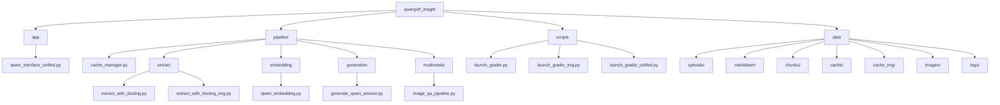

Here’s a polished `README.md` you can drop in. It’s comprehensive, in French, and includes a **graph of the project structure** (Mermaid), plus an **architecture** diagram. I’ve removed Troubleshooting, Contribution, and Roadmap sections as requested.

---

# 📄 QwenPDF Insight — Multimodal RAG Pipeline

QwenPDF Insight est un pipeline **RAG (Retrieval-Augmented Generation)** multimodal pour analyser des **PDF non structurés** (texte, tableaux, graphiques, schémas) et répondre à des questions en **langage naturel**.
Il combine **Docling** (extraction), **Qwen3** (embeddings + génération texte), **CLIP** (sélection d’images), et **Qwen-VL** (raisonnement visuel) avec **cache** persistant et **UI Gradio**.

---

## ✨ Fonctionnalités

* **Extraction PDF robuste** : texte, tableaux, images, plus **rendu de pages** (utile pour graphiques vectoriels).
* **Chunking intelligent** : préserve l’intégrité des **tableaux** et **descriptions d’images**.
* **Recherche sémantique** : Qwen3-Embedding + NearestNeighbors + *cross-encoder* pour améliorer la précision.
* **Vision-LLM** : Qwen2.5-VL-3B en 4-bit avec **fallback GPU/CPU automatique** quand la VRAM est limitée.
* **Sélection d’images Zero-Shot** : CLIP (LAION) pour détecter *chart/table/diagram/flowchart*.
* **UI Gradio unifiée** : interface simple, zones **scrollables**, affichage du **Résumé VLM** en mode ++.
* **Caches séparés par mode** et **nettoyage auto des images** pour `text-image++`.

---

## 🧱 Architecture fonctionnelle

```mermaid
flowchart TD
    A[PDF] --> B[Docling\nTexte + Tables + (Captions)]
    B --> C[Chunking\npréservant tables & captions]
    C --> D[Qwen3-Embedding]
    D --> E[NearestNeighbors + CrossEncoder]
    E --> F[Passages top-k]
    A --> G[Extraction d’images &/ou Rendu de pages]
    G --> H[CLIP Zero-shot Scoring]
    H --> I[Top-k images pertinentes]
    I --> J[Qwen2.5-VL 4-bit\n(fallback GPU/CPU)]
    F --> K[Fusion Texte + Visuel]
    J --> K
    K --> L[Réponse finale]
```

---

## 🗂️ Graphe de structure du projet



---

## 📁 Organisation du dépôt

```
qwenpdf_insight/
├── app/
│   └── qwen_interface_unified.py       # UI Gradio (modes + résumé VLM, logs)
├── pipeline/
│   ├── cache_manager.py                # Cache SHA256 (chunks, embeddings, index reconstruit)
│   ├── extract/
│   │   ├── extract_with_docling.py     # Docling (texte + tableaux)
│   │   └── extract_with_docling_img.py # Docling (texte + tableaux + captions images)
│   ├── embedding/
│   │   └── qwen_embedding.py           # Qwen3 Embeddings + retrieval + rerank cross-encoder
│   ├── generation/
│   │   └── generate_qwen_answer.py     # Génération smart (texte & multimodal, retour VLM)
│   └── multimodal/
│       └── image_qa_pipeline.py        # CLIP + Qwen-VL (4-bit + fallback offload)
├── scripts/
│   ├── launch_gradio.py                # legacy (texte)
│   ├── launch_gradio_img.py            # legacy (texte + images)
│   └── launch_gradio_unified.py        # optionnel, lance l’UI unifiée
├── data/
│   ├── uploads/    # PDF uploadés (hash)
│   ├── markdown/   # Exports Docling (.md)
│   ├── chunks/     # Chunks concaténés
│   ├── cache/      # cache (text-only)
│   ├── cache_img/  # cache (text-image & ++)
│   ├── images/     # images extraites/rendu (temp)
│   └── logs/       # interface_log.txt
├── requirements.txt
├── LICENSE
└── README.md
```

---

## ⚙️ Installation

1. Cloner et se placer dans le dossier :

```bash
git clone https://github.com/kratosra/qwenpdf_insight.git
cd qwenpdf_insight
```

2. Créer un venv (recommandé) et installer :

```bash
pip install -r requirements.txt
```

3. Se connecter à Hugging Face si nécessaire :

```bash
huggingface-cli login
```

4. Modèles requis :

* `Qwen/Qwen3-Embedding-0.6B`
* `Qwen/Qwen3-0.6B` (ou `Qwen/Qwen3-0.6B-Chat`)
* `cross-encoder/ms-marco-MiniLM-L-6-v2`
* `laion/CLIP-ViT-B-32-laion2B-s34B-b79K`
* `Qwen/Qwen2.5-VL-3B-Instruct`

---

## ▶ Lancement (UI Gradio unifiée)

```bash
python app/qwen_interface_unified.py
```

* **Entrées** : PDF, question, mode (`text-only`, `text-image-with-docling`, `text-image++`).
* **Sorties** :

  * Réponse générée
  * Passages extraits (*top-k*)
  * **Résumé VLM** (uniquement en `text-image++`) : description Qwen-VL + images retenues + labels CLIP
  * Diagnostic JSON + bouton pour télécharger le log

> Les zones de texte sont **scrollables** pour faciliter la lecture de longues réponses.

**Legacy (optionnel)**

```bash
python scripts/launch_gradio.py          # version texte
python scripts/launch_gradio_img.py      # version texte + images (ancienne UI)
```

---

## 🧩 Modes & Caching

| Mode                      | Extraction Docling                     | Cache embeddings | Dossier cache    | VLM Qwen-VL       | Images persistées        |
| ------------------------- | -------------------------------------- | ---------------- | ---------------- | ----------------- | ------------------------ |
| `text-only`               | Texte + tableaux                       | ✅                | `data/cache`     | ❌                 | —                        |
| `text-image-with-docling` | Texte + tableaux + **captions images** | ✅                | `data/cache_img` | Auto (si requise) | `data/images/<hash>`     |
| `text-image++`            | Idem ci-dessus + **force VLM**         | ✅ (texte)        | `data/cache_img` | ✅ (forcée)        | **Non** (nettoyage auto) |

* La **clé de cache** est le **hash SHA256** du PDF (géré par `EmbeddingCacheManager`).
* L’index est **reconstruit** à partir des embeddings lorsqu’on recharge le cache.

---

## 🔧 Paramètres “sûrs” (n’affectent pas le cache)

Ces valeurs par défaut sont fixées dans `app/qwen_interface_unified.py` (et/ou peuvent être ré-exposées dans la UI sans invalider le cache) :

* `k_images = 4` — nombre d’images envoyées à Qwen-VL
* `min_prob = 0.18` — seuil CLIP pour filtrer les images
* `page_dpi = 180` — DPI pour rendu de pages (vectoriels)
* `extract_full_pages = False` — activer le rendu bitmap si besoin

### Variables d’environnement

```bash
# logs terminal (DEBUG / INFO / WARNING / ERROR)
export LOGLEVEL=DEBUG

# limiter la fragmentation CUDA (utile sur petites VRAM)
export PYTORCH_CUDA_ALLOC_CONF=expandable_segments:True
```

---

## 🧠 Détails techniques clés

### 1) Extraction & Chunking

* **Docling** génère un **Markdown** propre.
* Les **tables** et **captions d’images** sont **préservées** dans un même chunk.
* Fenêtre glissante pour garder du contexte entre chunks.

### 2) Recherche sémantique

* **Embeddings** : `Qwen/Qwen3-Embedding-0.6B`.
* **Index** : `NearestNeighbors` (brute) + **CrossEncoder** pour *reranking*.
* **Top-k** passages → passés au générateur texte.

### 3) Vision-LLM robuste

* **Filtrage des images** avant VLM via `_is_valid_for_vlm()` :

  * dimensions minimales,
  * **ratio** max strict (*< 200*) pour éviter l’erreur *absolute aspect ratio must be smaller than 200*.
* **Fallback** : rendu de pages si aucune image valide (très utile pour graphes vectoriels).
* **Quantization 4-bit (bitsandbytes)** + **fallback automatique** `device_map="auto"` et offload CPU si VRAM faible.

---

## 🔐 Données & Sécurité

* Tout le traitement est **local** (pas d’envoi cloud non configuré).
* Le dossier `data/` est prévu pour rester **hors versionnement** (ajoutez-le dans `.gitignore`).
* Les PDFs uploadés sont renommés par **hash** dans `data/uploads/`.

---

## 👤 Auteur

**Ahmed Amine Jadi** — 2025
Stage ingénieur — *AtlantaSanad Assurance*

* GitHub : [https://github.com/kratosra](https://github.com/kratosra)
* LinkedIn : [https://www.linkedin.com/in/ahmed-amine-jadi-958010373/](https://www.linkedin.com/in/ahmed-amine-jadi-958010373/)
* Email : [amine\_jadon@outlook.fr](mailto:amine_jadon@outlook.fr)

---

## 📜 Licence

MIT — voir `LICENSE`.
