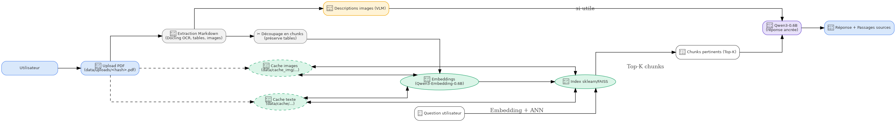

#  QwenPDF Insight – Multimodal RAG Pipeline

QwenPDF Insight est un système **RAG (Retrieval-Augmented Generation)** modulaire conçu pour **analyser automatiquement des documents PDF non structurés**, en extrayant du texte, des tableaux, des images, puis en répondant à des questions posées en langage naturel à l'aide du modèle **Qwen3-0.6B** .

---

##  Fonctionnalités principales

*  **Extraction intelligente de contenu PDF** (texte, tableaux, images)
*  **Segmentation automatique** en *chunks* de documents
*  **Embeddings vectoriels** via `Qwen3-Embedding`
*  **Indexation vectorielle** .
*  **Reranking cross-encoder** pour améliorer la précision
*  **Génération de réponses** à l’aide de `Qwen3`
*  **Interface Streamlit** pour interagir avec le système
*  **Nettoyage automatique des fichiers temporaires**

---

##  Lancement rapide

###  1. Installation des dépendances

Crée un environnement virtuel si besoin, puis installe :

```bash
pip install -r requirements.txt
```

###  2. Télécharger les modèles (Qwen)

Tu dois avoir accès à :

* `Qwen/Qwen3-Embedding-0.6B`
* `Qwen/Qwen3-0.6B-Chat`
* Cross-encoder pour reranking (ex. `cross-encoder/ms-marco-MiniLM-L-6-v2`)

Assure-toi d’être connecté à HuggingFace si les modèles sont restreints.

### ▶ 3. Lancer l’interface utilisateur

```bash
py .\scripts\launch_gradio.py  
ou pour une analyze avec image 
py .\scripts\launch_gradio_img.py  
```

---
##  Exemple de cas d’utilisation

1.  Upload d’un fichier PDF contenant un rapport d’entreprise
2.  Question : *"Quels sont les résultats financiers du Q3 2023 ?"*
3.  Le système :

   * Extrait et segmente le document
   * Calcule les embeddings des passages
   * Recherche les passages les plus pertinents
   * (Optionnel) Rerank les résultats
   * Génère une réponse avec Qwen3
4.  Réponse générée en langage naturel

## 🖼️ Schéma du pipeline



---

##  Dépendances clés

* `transformers`, `qdrant-client`, `faiss-cpu`
* `markdown`, `numpy`, `streamlit`, `scikit-learn`
* (optionnel) `docling` ou autre outil pour l'extraction PDF

Installez-les via :

```bash
pip install -r requirements.txt
```

---

##  Fonctions importantes à explorer

* `extract_with_docling.py` → Markdown structuré depuis PDF
* `qwen_embedding.py` → Embeddings Qwen3 + reranker
* `faiss_store.py` / `qdrant_store.py` → Vector store
* `core_pipeline.py` → Chaîne d’orchestration RAG
* `generate_qwen_answer.py` → Réponse à partir du contexte

---

##  Sécurité des données

* Tous les fichiers restent **locaux** (pas d’appel cloud sans autorisation)
* `data/` est exclu du Git pour éviter les fuites de documents

---

##  Auteur

Développé par **Ahmed Amine Jadi** dans le cadre d’un stage d’ingénieur à AtlantaSanad Assurance (2025), combinant NLP, vector stores, modèles de langage et interaction PDF multimodale.

---

##  Contact / Collaboration

Si vous souhaitez discuter ou contribuer :

* [Profil GitHub](https://github.com/kratosra)
* [LinkedIn](https://www.linkedin.com/in/ahmed-amine-jadi-958010373/)
* Email : [amine_jadon@outlook.fr](mailto:amine_jadon@outlook.fr)

## License
[](LICENSE)
[](https://www.python.org/)
