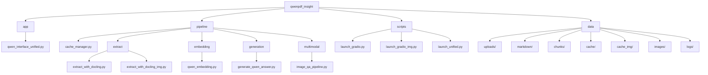

# 📄 QwenPDF Insight — Multimodal RAG Pipeline


**QwenPDF Insight** est un pipeline **RAG (Retrieval-Augmented Generation)** multimodal pour analyser des **PDF non structurés** (texte, tableaux, graphiques, schémas) et répondre à des questions en **langage naturel**, avec UI Gradio et mécanismes de **cache**.

Il combine **Docling** (extraction), **Qwen3** (embeddings + génération), **CLIP** (sélection d’images), et **Qwen-VL** (raisonnement visuel). Tout le traitement est **local** par défaut.

---

## ✨ Fonctionnalités

- **Extraction PDF robuste** → Markdown (texte + tableaux + *captions d’images*).
- **Chunking intelligent** conservant tables & légendes.
- **Recherche sémantique** (embeddings Qwen3 + FAISS/KNN + *rerank* cross-encoder).
- **Vision-LLM** (Qwen-VL quantisé 4-bit, fallback GPU/CPU).
- **Sélection d’images zero-shot** (CLIP) : `chart / table / diagram / flowchart`.
- **UI Gradio unifiée** avec logs, diagnostic JSON et export Markdown.
- **Caches** séparés par mode + nettoyage auto des images temporaires.

---

## 🧱 Architecture (vue fonctionnelle)

```mermaid
flowchart TD
    A[PDF] --> B[Docling\nTexte + Tables + Captions]
    B --> C[Chunking]
    C --> D[Embeddings Qwen3]
    D --> E[Retrieval (KNN/FAISS)\n+ Rerank CrossEncoder]
    E --> F[Top-k passages]
    A --> G[Extraction figures / rendu page]
    G --> H[CLIP Zero-shot]
    H --> I[Top-k images pertinentes]
    I --> J[Qwen-VL 4-bit\n(fallback GPU/CPU)]
    F --> K[Fusion Texte ⊕ Visuel]
    J --> K
    K --> L[Réponse finale + Export MD]
```

---

## 🗂️ Graphe de structure du projet



---

## 📁 Organisation

```
qwenpdf_insight/
├── app/                       # Interface Gradio unifiée
│   └── qwen_interface_unified.py
├── pipeline/
│   ├── cache_manager.py
│   ├── extract/
│   │   ├── extract_with_docling.py
│   │   └── extract_with_docling_img.py
│   ├── embedding/qwen_embedding.py
│   ├── generation/generate_qwen_answer.py
│   └── multimodal/image_qa_pipeline.py
├── scripts/
│   ├── launch_gradio.py
│   ├── launch_gradio_img.py
│   └── launch_unified.py         # ← script de lancement recommandé
├── data/
│   ├── uploads/    # PDF (hashés)
│   ├── markdown/   # Exports Docling
│   ├── chunks/     # Chunks concaténés
│   ├── cache/      # cache (text-only)
│   ├── cache_img/  # cache (text-image & ++)
│   ├── images/     # figures/rendu (temp)
│   └── logs/       # interface_log.txt
├── requirements.txt
├── LICENSE
└── README.md
```

---

## ✅ Prérequis

- **OS** : Linux, macOS, Windows 10/11
- **Python** : 3.10+
- **GPU (optionnel)** : CUDA 11.8+ recommandé pour Qwen-VL 4-bit
- **Disk** : prévoir de l’espace pour `data/` (exports, caches, images)

---

## ⚙️ Installation

```bash
git clone https://github.com/kratosra/qwenpdf_insight.git
cd qwenpdf_insight
python -m venv .venv && source .venv/bin/activate     # PowerShell: .venv\Scripts\Activate.ps1
pip install -r requirements.txt
```

Connexion Hugging Face si besoin :

```bash
huggingface-cli login
```

### Modèles utilisés

- `Qwen/Qwen3-Embedding-0.6B`
- `Qwen/Qwen3-0.6B` (ou `Qwen/Qwen3-0.6B-Chat`)
- `cross-encoder/ms-marco-MiniLM-L-6-v2`
- `laion/CLIP-ViT-B-32-laion2B-s34B-b79K`
- `Qwen/Qwen2.5-VL-3B-Instruct`

---

## ▶ Lancement

### Windows (PowerShell / CMD)

```bash
py .\scripts\launch_unified.py
```

### Linux / macOS

```bash
python scripts/launch_unified.py
```

**Modes** (sélection dans l’UI) :
- `text-only` — plus rapide, 100% textuel.
- `text-image-with-docling` — ajoute *captions* d’images (sans VLM).
- `text-image++` — multimodal complet (extraction figures → CLIP → Qwen-VL).

**Sorties UI** : réponse générée, passages *Top-k*, résumé VLM (mode ++), galerie d’images, log téléchargeable, export **Markdown**.

---

## 🔧 Paramètres utiles (sans casser le cache)

- `k_images = 4` — nb d’images passées à Qwen-VL  
- `min_prob = 0.18` — seuil CLIP  
- `page_dpi = 180` — rendu de pages (vectoriels)  
- `extract_full_pages = false` — rendu page entière si besoin  

**Env conseillés**

```bash
# logs console (DEBUG/INFO/WARNING/ERROR)
export LOGLEVEL=INFO
# limiter la fragmentation CUDA
export PYTORCH_CUDA_ALLOC_CONF=expandable_segments:True
```

---

## 🧩 Caching & perfs

| Mode                      | Extraction Docling                     | Cache embeddings | Dossier cache    | VLM Qwen-VL       | Images persistées        |
|---------------------------|----------------------------------------|------------------|------------------|-------------------|--------------------------|
| `text-only`               | Texte + tableaux                       | ✅                | `data/cache`     | ❌                 | —                        |
| `text-image-with-docling` | Texte + tableaux + *captions*          | ✅                | `data/cache_img` | Auto (si requise) | `data/images/<hash>`     |
| `text-image++`            | Idem + **force VLM**                   | ✅ (texte)        | `data/cache_img` | ✅ (forcée)        | Non (nettoyage auto)     |

**Clé de cache** : hash **SHA-256** du PDF (géré par `EmbeddingCacheManager`). L’index est **reconstruit** à la volée depuis les embeddings.

---

## 🔐 Données & sécurité

- Traitement **local** par défaut (pas d’envoi cloud non configuré).  
- Les PDFs sont renommés par hash dans `data/uploads/`.  
- Pensez à ignorer `data/` dans Git :

```gitignore
data/
*.log
*.cache
```

---

## 📸 Exemple d’utilisation (placeholders)

Place tes captures d’écran dans `docs/screenshots/` :

- `docs/screenshots/ui_upload.png` — Upload + choix du mode  
- `docs/screenshots/ui_response.png` — Réponse + top-k + résumé VLM  

---

## 👤 Auteur

**Ahmed Amine Jadi** — 2025  
Stage ingénieur — *AtlantaSanad Assurance*

- GitHub : https://github.com/kratosra  
- LinkedIn : https://www.linkedin.com/in/ahmed-amine-jadi-958010373/  
- Email : amine_jadon@outlook.fr

---

## 📜 Licence

MIT — voir `LICENSE`.
